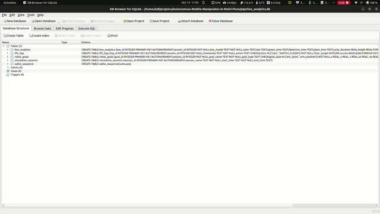

````markdown
# 🤖 Autonomous Mobile Manipulator in Multi-Floor

<div align="center">
  
</div>

## 🏗️ Overview

This project demonstrates a **complete ROS 2 Humble simulation** of an **autonomous mobile manipulator** that operates across **multiple floors** using an elevator.  
It integrates **navigation, manipulation, perception, and floor coordination** into one pipeline.

### 🧠 Key Components
- **AlphaBot Mobile Base (AMR)**
- **7-DOF RealMan Manipulator**
- **Linear Guide for Height Reach**
- **Gazebo Elevator Plugin** for multi-floor movement
- **Nav2** for autonomous navigation
- **MoveIt 2** for motion planning
- **Perception Pipeline** for package detection and pick-and-place
- **Database Logging** for task data and events

---

## 📁 Repository Structure

```bash
Autonomous-Mobile-Manipulator-in-Multi-Floor/
│
├── alphabot_description/           # URDFs, meshes, and robot model
├── rm_bringup/                     # RealMan manipulator setup
├── custom_robots/                  # Multi-floor world and robot spawn
├── mobile_manipulator_bringup/     # MoveIt bringup for manipulator
├── alphabot_navigation/            # Nav2 + Gazebo navigation setup
├── pipeline_manipulator/           # FSM and perception pipeline
├── elevator_plugin/                # Gazebo elevator control plugin
├── gif/                            # Simulation demo GIFs
└── README.md
````

---

## ⚙️ Requirements

* **Ubuntu 22.04 + ROS 2 Humble**
* **Gazebo 11**
* **MoveIt 2**
* **Nav2**
* **teleop_twist_keyboard**
* **SQLite / MySQL** (for database logging)

---

## 🧩 Environment Setup

Before launching, make sure your Gazebo environment can find the models and plugins:

```bash
export GAZEBO_MODEL_PATH=$GAZEBO_MODEL_PATH:$HOME/projetcs/Autonomous-Mobile-Manipulator-in-Multi-Floor/install/alphabot_description/share
export GAZEBO_PLUGIN_PATH=$HOME/projetcs/Autonomous-Mobile-Manipulator-in-Multi-Floor/install/elevator_plugin/lib:$GAZEBO_PLUGIN_PATH
```

---

## 🚀 Full Simulation Launch (3-Terminal Setup)

Run these three commands **in separate terminals** to start the full simulation system:

### 🦾 **Terminal 1 – MoveIt (Manipulator Control)**

Launches the RealMan manipulator and MoveIt 2 motion planning environment.

```bash
ros2 launch mobile_manipulator_bringup moveit_bringup.launch.py
```

### 🧭 **Terminal 2 – Navigation + Gazebo**

Starts Gazebo with the two-floor warehouse world, the AlphaBot AMR, Nav2 navigation stack, and elevator plugin.

```bash
ros2 launch alphabot_navigation gazebo.launch.py
```

### 🧩 **Terminal 3 – Pipeline / FSM (Main Logic)**

Runs the main pipeline node that coordinates all tasks: perception, pick-and-place, navigation, and floor transitions.

```bash
ros2 run pipeline_manipulator pipeline_fsm
```

> 🧠 **Tip:** Launch these in order — MoveIt first, then Navigation, and finally the Pipeline.

---

## 🎮 Optional Utilities

### Manual Teleoperation

You can manually move the robot base for debugging:

```bash
ros2 run teleop_twist_keyboard teleop_twist_keyboard --ros-args -r cmd_vel:=/amazon_robot/cmd_vel
```

### Elevator Control

Manually trigger the elevator using a service:

```bash
ros2 service call /elevator_cmd std_srvs/srv/SetBool "{data: true}"
```

### Linear Guide Control

```bash
ros2 topic pub /slider_position_controller/commands std_msgs/msg/Float64MultiArray "data: [0.5]" -1
```

---

## 🧠 System Workflow

1. **Pipeline Node (`pipeline_fsm`)** initializes.
2. Vision detects target package on rack.
3. Manipulator picks package using MoveIt.
4. AMR navigates to elevator (Nav2).
5. Elevator plugin lifts the robot to the upper floor.
6. AMR moves to drop zone table.
7. Arm places package and logs task in database.

---

## 🧱 Core Features

✅ Multi-floor warehouse with elevator
✅ Integrated MoveIt 2 + Nav2 control
✅ Perception-based pick-and-place
✅ Linear guide for extended reach
✅ Task database logging
✅ Dynamic obstacle simulation

---

## 📸 Simulation Demos

| Description      | Preview                                         |
| ---------------- | ----------------------------------------------- |
| Full System      |  |
| Warehouse World  |           |
| Linear Guide     |    |
| Database Logging |       |
| Pipeline Demo    |       |

---

## 🔧 Future Enhancements

* Add **3D vision-based grasping**
* Implement **battery & docking simulation**
* Extend to **multi-robot elevator coordination**
* Real-world testing with actual AlphaBot + RealMan hardware

---

## 👨‍💻 Author

**Mohammed Azif**
📧 [syedazif321@gmail.com](mailto:syedazif321@gmail.com)
🔗 [GitHub Profile](https://github.com/syedazif321)

---

## 🧾 License

Released under the **MIT License**.

```


